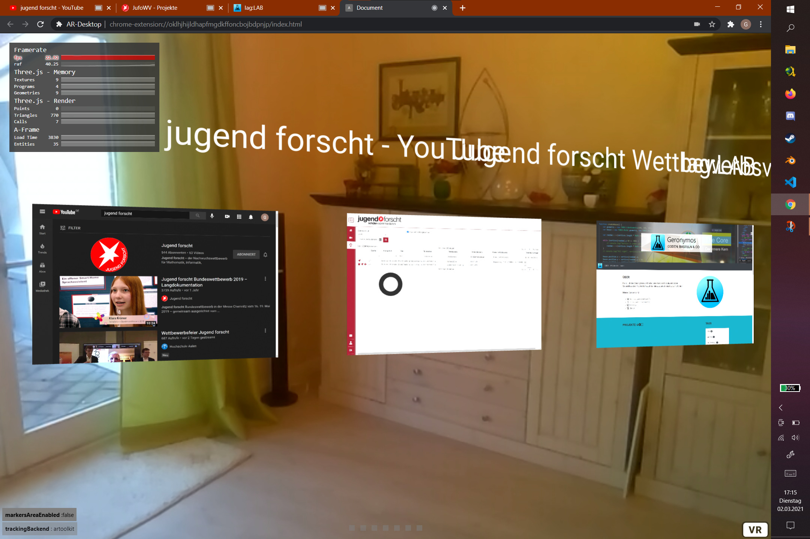
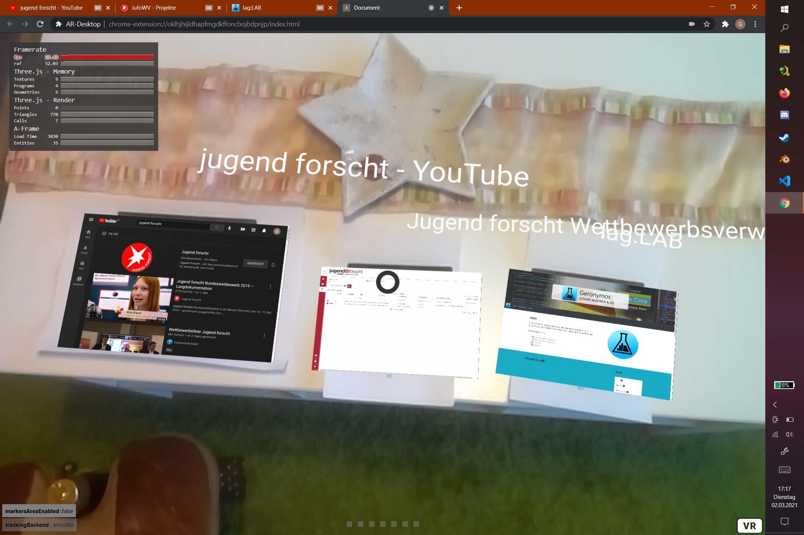

# AR-Desktop 💻
> Mixed reality for mobile working

<!-- ## Table of Contents

1. About
2. Getting Started
3. Usage
4. Develop
5. Galery
6. Build with
7. Roadmap
8. Related Projects
9. Authors
10. License
11. Acknowledgements -->


## About ❕

In this work I would like to create an application that enforces augmented reality in the broad masses, which is not only for fun, but also for work and does not require large investments. This should be possible with a device that everyone already has: the smartphone.

For this purpose, I am developing a mixed reality application in a stereoscopic view as a browser extension for smartphones, with which the limits of the monitor can be left and the dimensions of the room can be used to work independently of location.

You interact with the usual applications and websites in the form of virtual objects that merge with the real world via the direction of your gaze, gestures or external devices.

### Goals 🏁

- mobile 🏃
- cheap/free 💸
- productive 📊
- **FUN** 🥳

### Interactions 💪

- [X] Key inputs ⌨🕹
- [X] Movement inputs 📱
- [ ] Tracking 📸
- [ ] ~~Brain interface 🧠~~

## Getting Started

### Installing 📲

1. [Download](https://github.com/Geronymos/AR-Desktop/archive/minimal-browser.zip) or clone this repo with
```sh
git clone https://github.com/Geronymos/AR-Desktop.git
```
2. Build the browser extension. 
> ⚠ You need to have [node.js and npm](https://nodejs.org/)  installed! 
```sh
npm install
npm run build-ext
```
3. Now install the extension
    - Firefox 🦊: `about:addons > ⚙ > Install Add-on From File`
    - Chromium 🧿: `chrome://extensions/ > 🎚 Developer mode > load unpacked`

## Usage

1. [Generate barcode markers 🔳](https://au.gmented.com/app/marker/marker.php) for each tab (0 to ...) and print them 🖨 or show them on a screen 💻. 

2. Open your favorite web application and see it in the real world 🏞 by clicking on the browser action next to the url. 

3. The website will appear as a head-up display and will show in place of the barcode marker 🔳. 

## Develop 🛠

```sh
# For chromium
npm run chrome
# For Firefox
npm run firefox
```

## Galery 🖼

<table>
<tr>
<td></td>
<td></td>
</tr>
</table>

## ⚒ Build with

[](https://aframe.io/)

- [A-FRAME](https://aframe.io/) [[🐙](https://github.com/aframevr/aframe)] - 🅰 web framework for building virtual reality experiences. 
    - [Three.js](https://threejs.org/) [[🐙](https://github.com/mrdoob/three.js)] - JavaScript 3D library. 
- [AR.js](https://ar-js-org.github.io/AR.js-Docs/) [[🐙](https://github.com/AR-js-org/AR.js)] - Image tracking, Location Based AR, Marker tracking. All on the Web. 
- [web-ext](https://extensionworkshop.com/documentation/develop/getting-started-with-web-ext/) [[🐙](https://github.com/mozilla/web-ext)] - A command line tool to help build, run, and test web extensions 
- [Webpack](https://webpack.js.org/) [[🐙](https://github.com/webpack/webpack)] - A bundler for javascript and friends. 

## Roadmap

- [X] tab video streaming
- [X] click event transmittion
- [X] Keyboard input
- [X] multiple tabs
- [X] use environment camera in multi camera setups
- [X] stereoscopic camera
- [ ] virtual keyboard
- [ ] Firefox/Mobile support
- [ ] Hand-tracking
- [ ] 3D-Object-Repo

### Future 👾

- [Tensorflow Handpose](https://github.com/tensorflow/tfjs-models/tree/master/handpose) - Pretrained models for TensorFlow.js 
    - [Fingerpose 🐙](https://github.com/andypotato/fingerpose) - Finger pose classifier for hand landmarks detected by TensorFlow.js handpose model 
- [Mediapipe](https://google.github.io/mediapipe/solutions/hands) [[❔](https://google.github.io/mediapipe/solutions/hands#javascript-solution-api)] [[npm](https://www.npmjs.com/package/@mediapipe/hands)] - MediaPipe offers cross-platform, customizable ML solutions for live and streaming media. 
- [Superhands 🐙](https://github.com/wmurphyrd/aframe-super-hands-component) - 👐All-in-one natural hand controller, pointer, and gaze interaction library for A-Frame 

## Related Projects 🔗

- https://www.npmjs.com/package/web2vr
- https://www.npmjs.com/package/aframe-arjs-vr
- https://www.npmjs.com/package/aframe-html
- https://www.npmjs.com/package/aframe-html-shader
- https://github.com/mozilla/webextension-polyfill#installation

## Authors

- **Gero Beckmann** - *Initial work* - [Geronymos](https://github.com/Geronymos)

## License

This project is licensed under the GPT-3 License - see the `LICENSE` file for details

## Acknowledgements

Slack Mediapipe

GitHub, Stackoverflow, YouTube, Medium, Reddit

Presented at

[](https://www.jugend-forscht.de/)